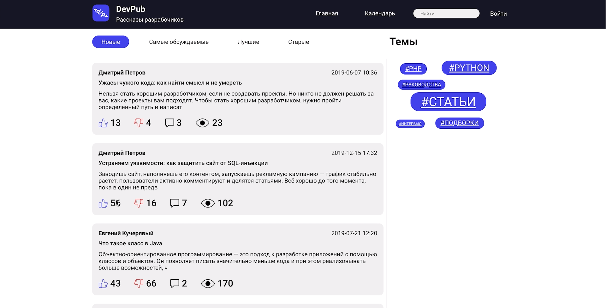

<h1 align="center">BlogEngine</h1>


## Description

BlogEngine implemented by scratch on Spring Boot, Mysql, Flyway, Docker and Docker-compose. The main features of the blog engine are writing posts, comments, searching the entire blog, viewing posts, user registration and blog moderation.

## Project setup

Create Google App password. How to do this you can find here https://support.google.com/accounts/answer/185833?hl=en.

Clone project from GIT repository and open docker-compose.yml. In fields GMAIL_USERNAME and GMAIL_PASSWORD write your e-mail and password that you created.

Build project using Maven.

```text
mvn clean install
```
Give execute permissions to file `start.sh` and execute it. Then visit `localhost:8080` and login with Email `admin@admin.ru` and password `admin123` to ensure that it works.